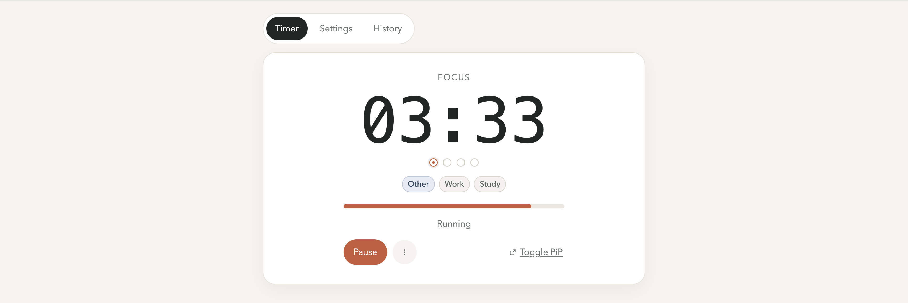

# Simple Pomodoro Timer

<p align="center">
  
</p>

<p align="center">
  A resilient browser timer for focused work, structured breaks, and reliable session continuity.
</p>

**Live demo:** [https://mbogdan0.github.io/simple-pomodoro/](https://mbogdan0.github.io/simple-pomodoro/)

## Product Snapshot

### Why this app exists

Simple Pomodoro Timer is for people who want predictable focus workflow without account setup or desktop installs. It keeps the interaction model simple while still letting you adapt cycle length, repeat count, and alerts to real workdays.

### User outcomes

- 🗓️ **Plan sessions quickly:** Set work, short break, and long break durations plus repeat count in minutes.
- ⚡ **Stay in flow with minimal friction:** Control the cycle using start, pause, resume, and reset from a single action area.
- 👀 **Keep context at a glance:** Follow step label, live clock, progress, repeat dots, and focus tag state in one view.
- 🔄 **Carry progress across refreshes:** Restore settings, active session, and focus history from browser storage automatically.
- 🪟 **Reduce context switching:** Open a Picture-in-Picture mini window that remains visible while you work in other tabs or apps.
- 🔔 **Receive timely nudges:** Get step completion alerts, a one-minute focus reminder, optional sound/vibration, and optional ntfy push.

### Best-fit scenarios

- 🎯 Solo deep-work blocks where consistent timing and low UI noise matter.
- 📚 Study sessions that need explicit focus/break cadence and quick interruption recovery.
- 🌐 Browser-first environments where installing native timer software is not preferred.

### Practical limits

- 📥 Offline mode works only after at least one successful online load in the same browser profile.
- 📡 ntfy push is sent by the active browser context, so the tab/browser must remain available for delivery attempts.
- 🧪 Browser capabilities vary; notification behavior, vibration, and PiP support depend on platform and permissions.

## Technical Overview

### Stack and module design

- 🧱 Vanilla JavaScript ES modules, no UI framework.
- 🧠 `src/app`: runtime orchestration (bootstrap, event wiring, worker bridge, lifecycle sync, render pipeline).
- ⚙️ `src/core`: domain logic for session transitions, settings normalization, alerts, storage, progress, PiP, and offline helpers.
- 🖼️ `src/ui`: deterministic markup renderers for timer, settings, and history panels.
- ⏱️ `src/worker.js`: dedicated timer runtime for high-frequency ticking and completion detection.
- 📦 `src/service-worker.js`: app-shell caching, stale cache cleanup, and notification relay fallback.

### Event handling boundaries

- 🧭 `src/app/events/root-events.js`: event delegation shell that binds listeners and routes click/change events.
- 🎛️ `src/app/events/root-action-handlers.js`: `data-action` command handlers for timer controls, tabs, history edits, tests, and PiP actions.
- 🛠️ `src/app/events/root-settings-handlers.js`: `data-*` settings mutation handlers (durations, repeat count, toggles, ntfy URL) with persistence and idle-session sync.

### Reliability model

- ⏱️ **Primary timing loop:** worker tick runs every `250ms` (`WORKER_TICK_INTERVAL_MS`).
- 🐕 **Completion watchdog:** worker schedules a precise timeout near `endsAt` to avoid missed boundaries.
- 🛡️ **Main-thread safety reconcile:** app runs a `500ms` guard interval to resync clock and chrome state.
- 🔄 **Lifecycle recovery:** visibility/focus/pageshow/pagehide/storage events trigger session restoration and worker sync.
- 📌 **Freshness arbitration:** `updatedAt` timestamps decide whether in-memory or stored session state wins.
- 🚦 **Degradation path:** if worker setup/runtime fails, actions fall back to local session control with user notice.

### Runtime capabilities

- 🔔 Notifications via `Notification` API when permission is granted, with service worker message-channel fallback.
- 📡 Optional ntfy.sh publish URL support for completion events and a dedicated connection test action.
- 🔊 Web Audio completion tone and lightweight UI action tone, primed by user gesture for autoplay compatibility.
- 📳 Vibration on completion where `navigator.vibrate` is supported.
- 🧾 Dynamic document title and generated favicon that mirror timer state and remaining time.
- 🪟 Manual PiP toggle with action forwarding (`start/pause/resume`) and optional 10-second clock quantization.
- 💾 Persistent local data for settings, active session snapshot, and focus history.

### Offline and PWA behavior

- 📱 Web App Manifest and installable metadata are included (`src/manifest.webmanifest`).
- 🧰 Service worker caches the app shell and applies cache version cleanup (`timer-offline-v2` strategy).
- 🌐 Navigation uses network-first with cached fallback; shell resources prefer fresh responses; static resources use cache-first with background refresh.
- ⚠️ Fresh offline usage in brand-new/incognito profiles without prior online load is intentionally unsupported.

### Development workflow

```bash
npm ci
npm run dev
npm run lint
npm run format:check
npm run typecheck
npm run test
npm run build
npm run check
```

- 🧪 `npm run dev`: starts esbuild watch mode with local dev server and sourcemaps.
- ✅ `npm run lint`: runs ESLint checks.
- 🎨 `npm run format:check`: verifies Prettier formatting.
- 🔎 `npm run typecheck`: runs TypeScript in JavaScript check mode (`allowJs` + `checkJs`, no emit).
- 🧪 `npm run test`: runs Vitest suite.
- 📦 `npm run build`: bundles production assets into `dist/` via `build.mjs`.
- 🛡️ `npm run check`: local quality gate (`lint` → `format:check` → `typecheck` → `test` → `build`).

### Quality and deployment

- 📊 Current baseline: `26` test files, `141` tests passing.
- 🧭 Coverage includes session transitions, worker/runtime behavior, lifecycle sync, notifications, PiP runtime, offline cache helpers, storage normalization, UI contracts, event handler maps, and dev server smoke checks.
- 🧰 CI quality gate sequence mirrors local checks: `lint` → `format:check` → `typecheck` → `test` → `build`.
- 🚀 GitHub Pages deployment is automated via `.github/workflows/deploy-pages.yml` (builds and publishes `dist` on `main` pushes).
